# 标准地址模块数据库模型设计（ER 草案）

## 1. 设计范围

- 本文仅覆盖 `标准地址模块`，范围严格对齐接口册：
  - 标准地址主资源
  - 标签
  - 导入记录与回滚
  - 操作日志
  - 安装地址
  - 监控规则、监控任务、异常记录
  - 异常修正工单
  - 选址平台所需的底层主数据支撑
- 不覆盖网格模块实体，但会在工单表中预留 `gridId/gridNameSnapshot` 以承接“修正工单可指定网格”的接口要求。

## 2. 设计原则

- 本轮数据库模型设计不以仓库既有表结构为约束，不要求兼容旧表；唯一基线是接口册与需求书备注。
- 历史证据允许合并引用：`nanjing-standard-address-core-*` 负责补充南京历史事实盘点、值域分布和迁移兼容链路，`online-schema-comment-inventory-*` / `ftth-cloud-address-schema-handbook.md` 负责补充线上最新非备份表结构、字段注释和类型映射；若与 `0323` 需求书冲突，以需求书为准。
- 表命名按业务语义重新设计，统一使用 `address_` 前缀，重点保证可读性、可维护性和后续实现清晰度。
- 公共审计字段沿用仓库已有 `TenantEntity/BaseEntity` 口径，不在 ER 图中重复展开：
  - `tenant_id`
  - `create_dept`
  - `create_by`
  - `create_time`
  - `update_by`
  - `update_time`
  - `del_flag`
  - `remark`
- 一、二级标准地址按需求书备注视为外部预置只读数据，主表显式保留只读/来源字段，并在实现层禁止新增、修改、删除、合并、拆分。
- 导入记录按“批次 + 明细”两层建模，满足“每一条导入数据都可查询、可回滚追溯”的要求。
- 标准地址属性采用“一对一扩展表 + 多值能力关系表”的建模思路，不再沿用旧版 KV 属性模型，更适合筛选、索引和后续规则校验。
- 标准地址需同时保留 `城区/非城区` 标识与 `城乡属性`：前者建议保留 legacy `is_city` 或等价字段，后者保留 `area_type` 或等价字段，两者不可混用。
- 安装地址与标准地址分表存储；正常业务口径下安装地址默认必须关联标准地址，并保留双向同步状态字段；仅为历史迁移、脏数据治理和异常清理保留有限 `UNBOUND` 态。
- 合并、拆分、导入回滚、名称级联刷新、双向增量同步等会影响历史追溯的场景，均在库表层预留痕迹字段或历史关系表。
- 新系统需兼容老系统对标准地址、安装地址、选址页面、XML/SOAP 报文的调用口径，因此数据库模型必须支持 legacy 标识、旧字典编码和外部接口审计留痕。

## 3. ER 图

> 说明：为避免图过大，ER 图仅展示业务关键字段；公共租户、审计、逻辑删除字段默认所有主业务表均继承。

```mermaid
erDiagram
    ADDRESS_STANDARD_ADDRESS ||--o{ ADDRESS_STANDARD_ADDRESS : parent_child
    ADDRESS_STANDARD_ADDRESS ||--o| ADDRESS_STANDARD_ATTRIBUTE : has_one
    ADDRESS_STANDARD_ADDRESS ||--o{ ADDRESS_STANDARD_ACCESS_CAPABILITY_REL : has_many
    ADDRESS_STANDARD_ADDRESS ||--o{ ADDRESS_STANDARD_TAG_REL : binds
    ADDRESS_STANDARD_TAG ||--o{ ADDRESS_STANDARD_TAG_REL : referenced_by
    ADDRESS_STANDARD_ADDRESS ||--o{ ADDRESS_STANDARD_STATION_REL : belongs_to
    ADDRESS_STANDARD_MANAGEMENT_STATION ||--o{ ADDRESS_STANDARD_STATION_REL : referenced_by
    ADDRESS_STANDARD_ADDRESS ||--o{ ADDRESS_INSTALLATION : binds
    ADDRESS_STANDARD_IMPORT_BATCH ||--o{ ADDRESS_STANDARD_IMPORT_DETAIL : contains
    ADDRESS_STANDARD_ADDRESS ||--o{ ADDRESS_STANDARD_IMPORT_DETAIL : create_or_update
    ADDRESS_STANDARD_ADDRESS ||--o{ ADDRESS_STANDARD_OPERATION_LOG : audited
    ADDRESS_STANDARD_OPERATION_LOG ||--o{ ADDRESS_STANDARD_LINEAGE : records
    ADDRESS_STANDARD_ADDRESS ||--o{ ADDRESS_STANDARD_LINEAGE : source
    ADDRESS_STANDARD_ADDRESS ||--o{ ADDRESS_STANDARD_LINEAGE : target
    ADDRESS_STANDARD_MONITOR_RULE ||--o{ ADDRESS_STANDARD_MONITOR_TASK_RULE_REL : binds
    ADDRESS_STANDARD_MONITOR_TASK ||--o{ ADDRESS_STANDARD_MONITOR_TASK_RULE_REL : binds
    ADDRESS_STANDARD_MONITOR_TASK ||--o{ ADDRESS_STANDARD_MONITOR_TASK_SCOPE_REL : scopes
    ADDRESS_STANDARD_MONITOR_TASK ||--o{ ADDRESS_STANDARD_MONITOR_TASK_RUN_LOG : runs
    ADDRESS_STANDARD_MONITOR_TASK_RUN_LOG ||--o{ ADDRESS_STANDARD_MONITOR_RECORD : generates
    ADDRESS_STANDARD_MONITOR_RULE ||--o{ ADDRESS_STANDARD_MONITOR_RECORD : hits
    ADDRESS_STANDARD_ADDRESS ||--o{ ADDRESS_STANDARD_MONITOR_RECORD : hit_on
    ADDRESS_STANDARD_MONITOR_RECORD ||--o{ ADDRESS_STANDARD_MONITOR_WARN_LOG : warns
    ADDRESS_STANDARD_MONITOR_RECORD ||--o| ADDRESS_STANDARD_WORK_ORDER : creates
    ADDRESS_STANDARD_WORK_ORDER ||--o{ ADDRESS_STANDARD_WORK_ORDER_LOG : operates
    ADDRESS_STANDARD_ADDRESS ||--o{ ADDRESS_STANDARD_WORK_ORDER : corrected_to

    ADDRESS_STANDARD_ADDRESS {
        bigint id PK
        bigint parent_id FK
        varchar ancestors
        varchar name
        varchar full_name
        varchar full_name_simple_spell
        varchar code
        tinyint level
        varchar is_city
        varchar area_type
        varchar legacy_segm_id
        varchar legacy_res_object_id
        varchar legacy_region_id
        varchar legacy_company_id
        varchar legacy_segm_type
        varchar status
        varchar province_code
        varchar city_code
        varchar district_code
        varchar street_code
        varchar village_code
        decimal longitude
        decimal latitude
        varchar read_only_flag
        varchar source_system
        varchar source_id
        bigint sync_version
        varchar sync_status
        varchar sync_batch_no
        datetime last_sync_time
        bigint deleted_by
        datetime deleted_time
    }

    ADDRESS_STANDARD_ATTRIBUTE {
        bigint id PK
        bigint standard_address_id FK
        varchar access_method
        varchar ftth_pon_type_id
        varchar ftth_pon_type_name
        varchar addr_in_type_ftth_id
        varchar addr_in_type_ftth_name
        varchar addr_in_type_lan_id
        varchar addr_in_type_lan_name
        varchar urban_rural_attr
        varchar house_property
        int coverage_households
        varchar project_number
        varchar supporting_fee_flag
    }

    ADDRESS_STANDARD_ACCESS_CAPABILITY_REL {
        bigint id PK
        bigint standard_address_id FK
        varchar capability_code
        int sort_order
    }

    ADDRESS_STANDARD_TAG {
        bigint id PK
        varchar name
        varchar code
        varchar color
    }

    ADDRESS_STANDARD_TAG_REL {
        bigint id PK
        bigint standard_address_id FK
        bigint tag_id FK
    }

    ADDRESS_STANDARD_MANAGEMENT_STATION {
        bigint id PK
        varchar station_code
        varchar legacy_station_id
        varchar legacy_region_id
        varchar station_name
        varchar status
        varchar source_system
        varchar source_id
    }

    ADDRESS_STANDARD_STATION_REL {
        bigint id PK
        bigint standard_address_id FK
        bigint station_id FK
        varchar station_role
    }

    ADDRESS_INSTALLATION {
        bigint id PK
        bigint standard_address_id FK
        varchar legacy_set_addr_id
        varchar legacy_set_addr_name
        varchar association_status
        varchar install_name
        varchar install_full_name
        varchar segmented_address_info
        varchar standard_address_full_name_snapshot
        varchar standard_address_spell_snapshot
        varchar resource_id
        varchar resource_type
        varchar device_id
        varchar device_name
        datetime install_time
        varchar boss_sync_status
        varchar source_system
        varchar source_id
        bigint sync_version
        varchar sync_status
        datetime last_sync_time
    }

    ADDRESS_STANDARD_IMPORT_BATCH {
        bigint id PK
        varchar file_name
        int total_count
        int success_count
        int fail_count
        varchar import_status
        varchar update_support_flag
        varchar rollback_status
        datetime rollback_time
    }

    ADDRESS_STANDARD_IMPORT_DETAIL {
        bigint id PK
        bigint batch_id FK
        int row_no
        bigint standard_address_id FK
        varchar import_action
        varchar import_status
        varchar current_name
        varchar full_name
        tinyint level
        varchar failure_reason
        json raw_data_json
        json before_snapshot_json
        json after_snapshot_json
        varchar rollback_status
    }

    ADDRESS_STANDARD_OPERATION_LOG {
        bigint id PK
        bigint standard_address_id FK
        varchar operation_type
        varchar operation_result
        bigint operator_id
        varchar operator_name
        datetime operation_time
        bigint related_batch_id
        json operation_detail_json
    }

    ADDRESS_STANDARD_LINEAGE {
        bigint id PK
        varchar lineage_type
        bigint source_address_id FK
        bigint target_address_id FK
        bigint operation_log_id FK
        datetime effective_time
    }

    ADDRESS_STANDARD_MONITOR_RULE {
        bigint id PK
        varchar name
        varchar rule_type
        varchar target_field
        varchar severity
        int dedup_hours
        varchar status
        text rule_content
    }

    ADDRESS_STANDARD_MONITOR_TASK {
        bigint id PK
        varchar task_name
        varchar task_type
        varchar execute_rule
        datetime execute_time
        varchar monitor_scope
        varchar task_status
        datetime last_execute_time
        varchar failure_reason
    }

    ADDRESS_STANDARD_MONITOR_TASK_RULE_REL {
        bigint id PK
        bigint task_id FK
        bigint rule_id FK
    }

    ADDRESS_STANDARD_MONITOR_TASK_SCOPE_REL {
        bigint id PK
        bigint task_id FK
        varchar scope_type
        varchar scope_value
    }

    ADDRESS_STANDARD_MONITOR_TASK_RUN_LOG {
        bigint id PK
        bigint task_id FK
        varchar trigger_source
        varchar execute_status
        int scanned_count
        int hit_count
        int warn_count
        datetime start_time
        datetime end_time
        bigint duration_ms
        text error_msg
    }

    ADDRESS_STANDARD_MONITOR_RECORD {
        bigint id PK
        bigint task_id FK
        bigint task_run_log_id FK
        bigint standard_address_id FK
        bigint rule_id FK
        varchar abnormal_address
        varchar address_full_name_snapshot
        varchar rule_name_snapshot
        varchar severity
        varchar status
        int hit_count
        datetime first_hit_time
        datetime last_hit_time
        varchar dedup_key
    }

    ADDRESS_STANDARD_MONITOR_WARN_LOG {
        bigint id PK
        bigint record_id FK
        varchar channel
        varchar send_status
        datetime send_time
        int retry_times
        text response_msg
    }

    ADDRESS_STANDARD_WORK_ORDER {
        bigint id PK
        varchar work_order_no
        bigint monitor_record_id FK
        varchar original_address
        varchar detail_address
        varchar corrected_address
        bigint corrected_standard_address_id FK
        bigint grid_id
        varchar grid_name_snapshot
        varchar work_order_status
        bigint handler_id
        varchar handler_name
        datetime handle_time
        varchar reject_reason
        bigint synced_standard_address_id
    }

    ADDRESS_STANDARD_WORK_ORDER_LOG {
        bigint id PK
        bigint work_order_id FK
        varchar action_type
        varchar action_result
        bigint action_by
        varchar action_by_name
        datetime action_time
        json action_detail_json
    }
```

## 4. 实体职责与关键约束

### 4.1 主数据层

#### `address_standard_address`

- 标准地址主表，承载树形层级、行政区划编码、名称、地址全名、级别、状态、经纬度、来源及同步信息。
- 关键约束：
  - `parent_id + name + tenant_id + del_flag` 建议唯一，避免同父节点下重名。
  - `level` 需满足父子层级连续规则，并兼容需求书定义的 `1-19` 级；legacy 口径中 `1/2` 级行政区划查询按 `spec_region`，其他级别按 `segm_addr` / 标准地址事实表，层级映射以 `segm_addr_type.level_id` 为准。
  - `is_city` 用于表达 `城区/非城区` 标识，仅仅作为属性存在，跟层级并无关系。
  - `area_type` 用于表达城乡属性，字典来自 `pub_restriction.keyword='AREA_TYPE'`，不能再直接代替 `is_city` 做城区判定。
  - 一、二级地址通过 `read_only_flag=Y` + `source_system` 标识为外部只读。
  - `ancestors` 用于加速“查下级地址”“级联刷新子树”“逻辑删除前校验子节点”。
  - `full_name_simple_spell` 用于满足“名称变更后同步刷新地址拼装简拼”的要求，建议按“中文转拼音首字母大写、中文括号转英文括号、数字不变”规则统一生成。
  - `source_system/source_id/sync_*` 用于历史迁移、全量/增量/双向增量同步。
  - `deleted_by/deleted_time` 用于实现“逻辑删除优先、物理删除后置”的审计口径。

#### `address_standard_attribute`

- 标准地址一对一扩展表，承载需求书明确的固定属性字段。
- 关键约束：
  - `standard_address_id` 建议唯一。
  - `coverage_households` 建议非负整数。
  - `urban_rural_attr` 参与 `8/9` 级规则校验，不建议仅放前端页面态。

#### `address_standard_access_capability_rel`

- 标准地址接入能力明细表，一条能力一行。
- 关键约束：
  - `standard_address_id + capability_code` 建议唯一。
  - 不建议将多值能力硬编码进单列字符串，否则后续按能力筛选、导出、统计会变重。

#### `address_standard_management_station`

- 管理站主数据表。
- 作用：
  - 供标准地址维护“维修 / 安装 / 营业”三类管理站归属。
  - 供详情回显、筛选、导出时展示站点名称。
- 关键约束：
  - 历史主数据当前参考 `spc_station`，并结合 `region_id` 做组织范围约束，因此主表建议显式保留 `legacy_region_id`。
  - 管理站类型字典来自 `pub_restriction.keyword='MANAGE_TYPE'`，其中 `2017101=维修`、`2017102=安装`、`2017103=营业`。
  - 由于源表当前不区分 `维修/安装/营业` 类型，业务角色不建议直接固化在主数据表，应通过关系表 `station_role` 表达。
  - `spc_station`、`spc_region` 当前可与 `0323` 需求书合并引用；若 `spec_region/spc_region` 命名或联调库结构存在差异，以实表核验结果修正映射。

#### `address_standard_station_rel`

- 标准地址与管理站关系表。
- 关键约束：
  - `standard_address_id + station_role` 建议唯一，满足“一条地址最多同时归属三种不同角色管理站，各角色最多一个”。
  - `station_role` 固定枚举：`MAINTENANCE`、`INSTALL`、`BUSINESS`。

#### `address_installation`

- 安装地址独立主表，正常业务默认关联标准地址，同时兼容历史治理态的少量未关联数据。
- 关键约束：
  - `association_status` 显式区分 `BOUND/UNBOUND`，避免只靠 `standard_address_id` 判空；其中 `UNBOUND` 建议只用于迁移、治理和异常清理场景。
  - 需要保存 `standard_address_full_name_snapshot/standard_address_spell_snapshot`，支持标准地址名称变更后的级联刷新。
  - `boss_sync_status`、同步时间及来源字段用于承接“安装地址修改需通知 BOSS”的需求，并建议补充标准地址 <-> 安装地址双向同步版本或状态字段。
  - 历史参考表可对齐 `tmp_addr_set_segm_nj_20260317`，便于迁移与联调核对。
  - 选址平台生成安装地址时直接落该表，无需单独房间安装地址中间表。

### 4.2 关联与轻量字典层

#### `address_standard_tag`

- 标签主表。
- 建议约束：
  - `tenant_id + name + del_flag` 建议唯一。
  - `code` 可选唯一，便于外部系统对接。

#### `address_standard_tag_rel`

- 地址与标签的多对多关系表。
- 建议约束：
  - `standard_address_id + tag_id` 唯一，保证绑定幂等。

### 4.3 导入、回滚与审计层

#### `address_standard_import_batch`

- 导入批次表，记录一次文件导入的总体结果。
- 关键字段：
  - `file_name`
  - `total_count/success_count/fail_count`
  - `import_status`
  - `update_support_flag`
  - `rollback_status/rollback_time`

#### `address_standard_import_detail`

- 导入明细表，粒度精确到 Excel 的每一行。
- 关键约束：
  - `batch_id + row_no` 建议唯一。
  - `raw_data_json` 保存原始导入行。
  - `before_snapshot_json/after_snapshot_json` 用于回滚新增/更新操作。
  - 失败记录只保留明细，不参与数据回滚删除。

#### `address_standard_operation_log`

- 统一操作审计日志，覆盖新增、修改、删除、合并、拆分、导入、回滚等动作。
- 关键约束：
  - `operation_type` 至少覆盖 `INSERT/UPDATE/DELETE/MERGE/SPLIT/IMPORT/ROLLBACK`。
  - `operation_detail_json` 保存操作前后关键差异，避免仅有文本不可结构化追溯。

#### `address_standard_lineage`

- 地址血缘/历史映射表，记录合并、拆分、迁移等结构性变化。
- 作用：
  - 满足“合并后先迁子节点再回收源地址”的历史追溯。
  - 满足“拆分后级别不变，但需保留拆分来源”的要求。
  - 为双向同步、旧系统映射、回溯查询提供稳定关系。

### 4.4 质量治理与工单层

#### `address_standard_monitor_rule`

- 监控规则主表。
- 关键约束：
  - `name + tenant_id + del_flag` 建议唯一。
  - `rule_type` 至少支持 `REGEX/DICT/CUSTOM`。
  - `target_field` 默认可指向 `full_name`，但建议保留以便后续扩展到更多字段。

#### `address_standard_monitor_task`

- 监控任务定义表。
- 关键约束：
  - `task_type` 支持 `ONCE/SCHEDULE/MANUAL`。
  - `monitor_scope=PART` 时需配合范围表保存地址或其他范围。
  - `last_execute_time/failure_reason` 用于任务列表与详情回显。

#### `address_standard_monitor_task_rule_rel`

- 任务与规则关系表。
- 建议约束：
  - `task_id + rule_id` 唯一。

#### `address_standard_monitor_task_scope_rel`

- 任务范围关系表。
- 用途：
  - 支持 `ALL/PART` 范围。
  - 后续如扩展“按地址 / 标签 / 管理站 / 层级”执行，无需改主表结构。

#### `address_standard_monitor_task_run_log`

- 任务运行日志表，记录每次扫描执行结果。
- 用途：
  - 支撑“立即执行监控”“任务列表结果概览”“重跑任务”“失败原因追溯”。

#### `address_standard_monitor_record`

- 异常记录主表。
- 关键约束：
  - 保存地址、规则、任务运行时的名称快照，防止主数据后续变更影响历史展示。
  - `dedup_key` 用于结合 `dedup_hours` 做重复命中去重。
  - `status` 至少支持 `PENDING/IGNORED/PROCESSED` 对应接口册口径。

#### `address_standard_monitor_warn_log`

- 异常预警发送日志。
- 用途：
  - 记录通知渠道、发送结果、重试信息，支撑后续企业微信/BOSS/站内消息扩展。

#### `address_standard_work_order`

- 异常修正工单主表。
- 关键约束：
  - 当前草案按“一条异常记录生成一条工单”设计，即 `monitor_record_id` 建议唯一。
  - 保留 `original_address/detail_address/corrected_address`，兼容只修正明细或直接给出完整修正地址两种口径。
  - `grid_id/grid_name_snapshot` 仅做工单记录，不在本模块建立网格外键。
  - `corrected_standard_address_id` 用于人工修正后指向最终落定的标准地址。

#### `address_standard_work_order_log`

- 工单操作日志表。
- 用途：
  - 支撑工单详情中的 `operationLogs[]`。
  - 记录创建、修正、驳回、状态流转等动作。

### 4.5 旧系统兼容建模补充

旧接口兼容文档落地后，数据库设计需要额外补齐以下能力，否则即使内部接口能跑通，也无法无损兼容老系统报文：

#### 4.5.1 legacy 标识不建议只放映射表

- 老接口高频使用的标识包括：
  - `segm_id`
  - `resObjectId`
  - `set_id`
  - `regionId`
  - `companyId`
  - `station_id`
  - `segmType`
- 这些字段建议直接落在热点主表或热点主数据表上：
  - `address_standard_address`
  - `address_installation`
  - `address_standard_management_station`
- 原因：
  - 地址树查询、模糊查询、旧页面回传和 XML/SOAP 报文组装都直接依赖这些字段。
  - 如果完全依赖独立映射表，海量查询和报文组装会增加额外 join 成本。

#### 4.5.2 接入能力需要从“泛化字段”升级为“兼容字段”

- 当前内部接口册中的 `accessMethod + accessCapabilityCodes[]` 抽象，无法完整覆盖老接口需要的三组字段：
  - `FTTH_PON_TYPE / FTTH_PON_TYPE_ID`
  - `ADDR_IN_TYPE_FTTH / ADDR_IN_TYPE_FTTH_ID`
  - `ADDR_IN_TYPE_LAN / ADDR_IN_TYPE_LAN_ID`
- 因此地址属性表至少需要保留这些兼容字段，内部接口可以继续提供泛化视图，但底层数据不能只保留一个抽象字段。

#### 4.5.3 需增加外部协议日志 / 补偿模型

- 老系统兼容能力中同时存在：
  - URL 入口调用
  - JSON 查询
  - XML 地址同步 / 地址查询
  - SOAP 标准地址变更通知
- 建议新增两类外围表或等价持久化模型：
  - `address_legacy_interface_log`
    - 记录接口编码、方向、协议、请求标识、关联地址 ID、原始请求报文、原始响应报文、处理结果、失败原因、重试次数
  - `address_legacy_sync_outbox`
    - 记录待发送到 BOSS 的变更事件、目标报文、状态、重试时间、最终结果
- 这两类表不一定放进标准地址主 ER 图核心区域，但在实现层建议作为正式模型存在。

#### 4.5.4 URL 密钥组建议配置化或表驱动

- 旧 URL 选址入口依赖：
  - `cipherIndex`
  - `cipherText`
  - 密钥生效时间 / 失效时间
- 如果密钥需要运维侧轮换和留痕，建议增加 `address_legacy_access_secret` 或等价配置模型，字段至少包含：
  - `cipher_index`
  - `cipher_key`
  - `cipher_type`
  - `effective_start_time`
  - `effective_end_time`
  - `status`
- 如果确认长期固定且不需要审计，也可仅放配置中心，但这会削弱运维可见性。

#### 4.5.5 兼容查询建议走“事务源 + 搜索投影”

- 老接口中的 `getAddress` 模糊查询和旧选址页面更适合走搜索投影，而不是直接在事务库做复杂 join。
- 建议：
  - `MySQL` 继续作为事实源，承载标准地址、安装地址、属性、同步日志
  - `ES` 承载 legacy 检索投影，至少冗余：
    - `legacySegmId`
    - `legacyResObjectId`
    - `legacyRegionId`
    - `legacySegmType`
    - `fullName`
    - `fullNameSimpleSpell`
    - `tagNames`
    - `管理站名称`
    - `接入能力兼容字段`
- 适配层再把 ES 结果还原成老系统要求的 `data` 字符串、`fullNameList`、`resourceSegment` 等结构。

## 5. 本轮建议直接采用的建模口径

- 标准地址属性使用“一对一固定字段扩展表”，不采用旧版 `attr_key/attr_value` KV 结构。
- 接入能力使用独立关系表，一条能力一行。
- 导入记录拆为“批次表 + 明细表”。
- 安装地址默认 `BOUND`，仅为历史迁移、脏数据治理和异常清理保留 `UNBOUND` 状态。
- 选址平台不单独新增业务表，直接复用标准地址树和安装地址表。
- 合并/拆分历史使用 `address_standard_lineage` 显式保存，而不是仅写一条文本日志。
- legacy 兼容相关的热点标识字段优先直接落主表，不建议全部依赖独立映射表。
- 老系统 XML/SOAP/URL 接口通过适配层承载，并补齐原始报文日志与发送补偿模型。

## 6. 待需求规则澄清事项

以下事项先在文档中显式列举，当前阶段不阻塞 ER 草案；待需求规则澄清后，再统一冻结 SQL 口径：

1. `接入能力` 的最终落库方式
   - 当前建议：关系表一条能力一行，同时在搜索投影中冗余能力数组
   - 待确认点：是否还需要兼容更多 legacy 接入能力字典，或仅保留当前已识别的三组字段

2. `导入记录` 的最终粒度
   - 当前建议：`批次表 + 明细表`
   - 待确认点：回滚是按整批回滚、按单条回滚，还是两种都要支持

3. `工单与异常记录` 的关系
   - 当前建议：`1 条异常记录 = 1 条工单`
   - 待确认点：后续是否存在“多条异常合并为一张工单”的业务场景

4. `管理站主数据` 的归属
   - 当前建议：本模块本地建表维护，并参考历史库 `spc_station + region_id` 初始化，同时保留 legacy `station_id`；管理站类型按 `MANAGE_TYPE` 字典映射
   - 待确认点：最终是本地维护，还是完全依赖外部主数据同步；以及需求书中的 `spec_region` 与历史盘点中的 `spc_region` 在联调库中的实际表名、层级规则和有效性规则如何落定

5. `单客户信息同步 / 批量客户信息同步` 的模块归属
   - 当前建议：先作为外部依赖接口记录在册，不纳入标准地址主数据核心 ER
   - 待确认点：是否由 `ruoyi-address` 直接承接，还是由客户中心 / BOSS 适配层承接

6. legacy `地址同步接口 / 地址查询接口` 的最终方向与触发边界
   - 当前建议：先按“兼容请求与响应报文结构”建模
   - 待确认点：究竟是我方接收 BOSS 请求、我方主动推送，还是双向都要；`ADD/UPDATE/QUERY` 各动作的触发时机需明确

7. legacy 标识生成与映射规则
   - 当前建议：数据库保留 `legacy_segm_id/legacy_set_addr_id/legacy_region_id/...`
   - 待确认点：这些 ID 是沿用老系统原值、迁移时一次性映射生成，还是新系统需继续按老规则实时生成

8. URL 选址入口密钥组管理方式
   - 当前建议：如需轮换与留痕，增加独立密钥配置模型或配置中心能力
   - 待确认点：密钥是否需要库表化、谁负责维护、失效窗口和时钟误差容忍值是否仍沿用旧文档

9. 搜索投影中 legacy 展示字段的还原规则
   - 当前建议：`MySQL` 保存事实数据，`ES` 保存检索投影，适配层还原 `fullNameList/resourceSegment/data` 等 legacy 结构
   - 待确认点：`fullNameList` 的高亮 HTML、`resourceSegment` 的内容结构，是否必须与旧系统完全逐字符一致

10. 外部协议日志与补偿能力的保留周期
   - 当前建议：保留原始请求报文、原始响应报文、处理结果、失败原因、重试记录
   - 待确认点：日志保存时长、敏感字段脱敏范围、是否需要人工重放入口

## 7. 下一步

- 待上述事项在需求规则层面澄清后，再按冻结口径输出 SQL 脚本。
- SQL 会尽量复用现有仓库命名和审计字段风格，输出到 `script/sql` 下的新脚本文件中，避免覆盖旧版草稿。
